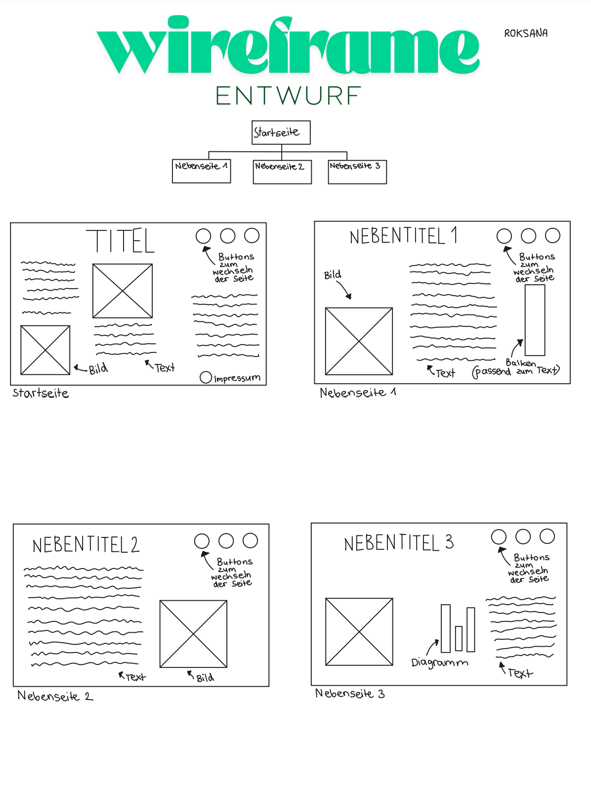

# Tierwelt – Chihuahua Webseite

##  Live-System
https://roksana422.github.io/Tierwelt_Chichuahua/

## Wireframe

## Thema & Zielgruppe
Die Webseite stellt die beiden bekanntesten Chihuahua-Arten vor: Kurzhaar und Langhaar.  
Zielgruppe sind Hundefreunde, Tierliebhaber und Personen die sich für kleine Hunderassen interessieren.

##  Seitenübersicht & Navigationskonzept
- **Startseite (index.html):** Begrüssung, allgemeine Infos und Bild mit verschiedenen Chichuahuas, Diagramm.
- **Kurzhaar Chihuahua (inhalt1.html):** Infos, Bild und Vergleichstabelle  
- **Langhaar Chihuahua (inhalt2.html):** Infos und Bild 
- **Kontakt (impressum.html):** Kontaktinformationen und Standort(Karte), und E-Mail.

Navigation: Einheitliches Menüband oben rechts auf jeder Seite.

##  Genutzte Quellen
- Bilder: Pixabay
- Texte: eigene Zusammenfassung (Quelle: Wikipedia, Google)
- Ich habe darauf geachtet, dass keine geschützten Inhalte ohne Lizenz übernommen wurden.

##  Besonderheiten & Extras
- Einheitliches Design auf allen Seiten
- Bilder leuchten weiss auf, wenn man sie anklickt
- Vergleichstabelle Kurzhaar vs. Langhaar
- Responsives Design (funktioniert auch auf dem Handy)
- Unterhalb vom Impressum gibt es eine kleine Bildergalerie mit Bildern
- Bilder haben einen runden Rand.
- Hintergrund des Titels hat einen Farbverlauf.

## Bekannte Limitierungen
- Es sind nur wenige Bilder eingebaut, nicht so viele wie auf grossen Webseiten
- Inhalte sind noch nicht sehr ausführlich, man könnte mehr Text einsetzen.
- Keine dynamische Filterung der Tierseiten (alle Tiere statisch

## Ideen für Weiterentwicklung
- Mehr Infos über andere Hunderassen hinzufügen
- Webseite zweisprachig machen (z.B Deutsch, English und Französisch)
- Weitere Unterseiten für z. B. Pflege, Futter oder Training
- Eventuell ein Quiz oder Umfrage am Ende der Webseite.

